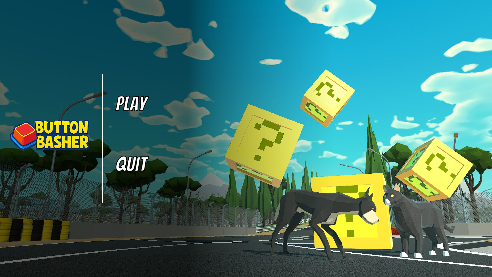
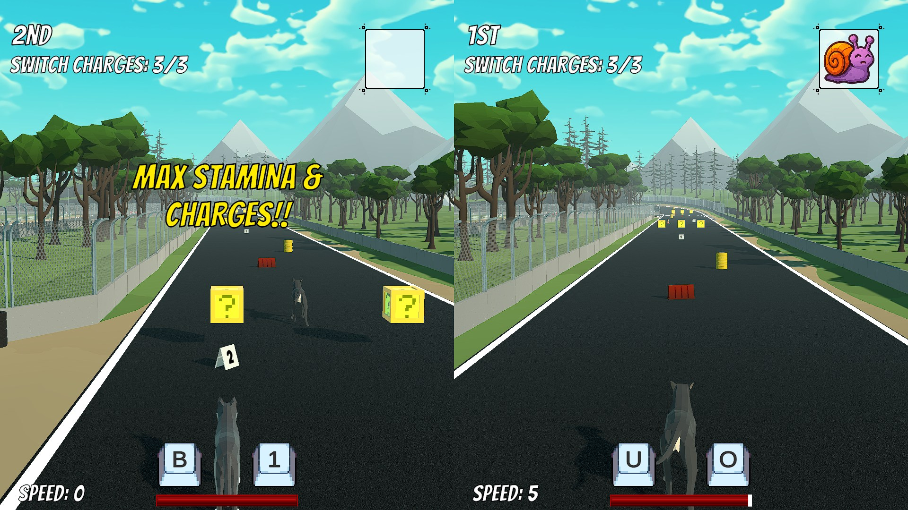

# Button Basher

A split-screen arcade racer where you don't steer with a stick — you drive by mashing the two keys the game hands you.

Built in **Unity 2022.3.43f1**.

> **Source-only mirror.** This repository contains the game's code, scenes, prefabs, audio and original art. The third-party Asset Store packs the scenes depend on are licensed content and are **not** redistributable, so they are excluded — see [Restoring the full project](#restoring-the-full-project). A prebuilt Windows player that needs no imports is on the [Releases](../../releases) page.

## Screenshots


<sub>Main menu.</sub>


<sub>Head-to-head split-screen. Each racer has their own randomised key prompts — left is on <b>B / 1</b>, right on <b>U / O</b> — plus switch charges, a speed readout and a stamina bar. The yellow boxes with question marks are power-up pickups, the snail in the top right is a Slow power-up landing on the opponent, and the banner is a quick-event reward.</sub>

## How it plays

Each racer is shown **two keys**. Alternate them to build speed — pressing the same key twice in a row doesn't count, so you have to actually bash (`Scripts/Player/PlayerMovement.cs`, `KeyRandomizer.cs`).

- Every **9–30** correct presses the keys shuffle to two new ones and you're granted **one lane-switch charge** (max 3 held).
- Endurance mode drains **10 endurance/sec** while a correct press returns **5** — keep mashing or the run ends (`Scripts/GameModes/Endurance.cs`).
- **Power-up boxes** spawn along the track: Speed Boost, Slow, Stun, Trap, Shield, Stamina Increase, Decrease Opponent Stamina (`Scripts/Interactables/PowerUpTypes.cs`, `Managers/PowerUpSpawner.cs`).
- **Obstacles** are generated into the track and physically bump you off line (`Managers/ObstacleGenerator.cs`).
- **Quick-Time Events** fire every **15–30 seconds** and last **3 seconds**: hit the key shown on your side of the screen and a reward is revealed (`Managers/QuickEventManager.cs`, `UI/QTE_UI_Display.cs`).

## Modes

| Scene | Mode |
| --- | --- |
| `Assets/Scenes/SplashScreen.unity` | Boot / launch screen |
| `Assets/Scenes/MainMenu.unity` | Main menu, options, profile |
| `Assets/Scenes/GameModes/Endurance (S).unity` | Endurance — solo |
| `Assets/Scenes/GameModes/Time Attack (S).unity` | Time Attack — solo |
| `Assets/Scenes/GameModes/PvP Endurance.unity` | Endurance — 2 players |
| `Assets/Scenes/GameModes/PvP Splitscreen.unity` | Head-to-head split-screen |
| `Assets/Scenes/DEBUG/DEBUG Scene.unity` | Sandbox for testing |
| `Assets/Scenes/DEBUG/PvP Splitscreen (Debug).unity` | Sandbox, 2 players |

## Controls

Bindings are per-scene and per-player, configured in the Inspector rather than the Input Manager.

| Input | Action |
| --- | --- |
| The two displayed keys | Alternate to accelerate, gain endurance |
| `Space` (default) | Jump |
| Lane-switch keys + charges | Move between the three lanes (left / centre / right) |
| QTE key (shown on screen) | Claim a quick-event reward |

Lane charges, speed, drain rate, key pool and QTE timing are all public fields — the `Editor/` folder adds inspectors for `PlayerPowerUp` and `QuickEventManager`.

## Requirements

- **Unity 2022.3.43f1** — open with the Hub. Another version will silently upgrade the project and its assets.
- Packages resolve automatically from `Packages/manifest.json` (ProBuilder, TextMeshPro, Timeline, Post Processing, Visual Scripting, 2D Sprite/Shape, glTFast).

## Restoring the full project

Clone and open — the code, scenes and prefabs all load, but every third-party reference resolves to *missing* until the packs below are imported from the Asset Store. Unity records imported Asset Store packages as loose files, not as a manifest entry, so folder names are the only identifier kept in this repo:

| Folder in a full project | Pack |
| --- | --- |
| `Assets/polyperfect/` | polyperfect — Low Poly Animated Animals |
| `Assets/Mesh/CartoonTracksPack1/` | Cartoon Tracks Pack |
| `Assets/Feel/` | MoreMountains Feel + MMFeedbacks |
| `Assets/Feel/NiceVibrations/` | Lofelt NiceVibrations (free) |
| `Assets/Plugins/BezierSolution/` | Bezier Solution |
| `Assets/Materials/CubeMap/`, `Assets/Materials/Panoramic/` | Anime sky / panorama cubemaps |

These paths are listed in `.gitignore` so they can't be committed by accident. Nothing else in the project is excluded, and no file is larger than 23 MB.

## Layout

```
Assets/Scripts/        34 C# scripts
  GameModes/           Endurance, Time Attack
  Interactables/       power-up boxes, traps, obstacles, finish triggers
  Managers/            QTE manager, obstacle + power-up generators, launch screen
  Player/              movement, stamina, lane charges, QTE handler, key randomizer
  UI/                  speedometer, stamina + endurance bars, QTE and reward UI
  Editor/              custom inspectors
Assets/Scenes/         splash, menu, four game modes, two debug sandboxes
Assets/Prefabs/        obstacles, power-up box, shield, trap, sound master
Assets/Textures/       logo, power-up icons, key icons, menu backgrounds
Assets/Sounds/         music, power-up, player and UI effects
Packages/              manifest + lock
ProjectSettings/       Unity project settings
```

## Licence

No licence is granted for this code. The repository is published as a build-and-source reference; the third-party assets referenced above remain the property of their authors and are not included.
